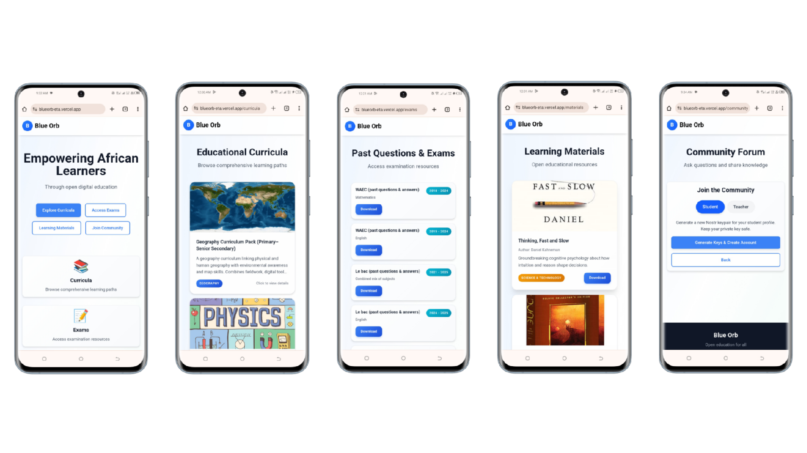

# Blue Orb - Open Education Hub for Africa

**Empowering African learners through digital resources and decentralized community**

Blue Orb is a comprehensive educational platform that provides access to curricula, exam materials, learning resources, and a community-driven Q&A forum. Built with modern web technologies and powered by Nostr for decentralized community features.

## 🌟 Vision

To democratize education across Africa by providing free, accessible, and community-driven learning resources that bridge the digital divide and empower learners to achieve their academic goals.

## ✨ Key Features

- **📚 Comprehensive Curriculum Access**: Browse and download educational curricula from various African countries
- **📝 Exam Materials**: Access past exam papers and study materials organized by subject and year
- **📖 Learning Resources**: Rich collection of educational materials including PDFs, images, and interactive content
- **💬 Decentralized Community Forum**: Ask questions, get answers, and engage with teachers and students using Nostr protocol
- **👥 Role-Based Access**: Separate experiences for students, teachers, and administrators
- **🌍 Multilingual Support**: English and Wolof language support with i18n framework
- **📱 Responsive Design**: Optimized for desktop, tablet, and mobile devices
- **🔒 Secure Authentication**: Nostr-based decentralized authentication for community features
- **⚡ Fast Performance**: Built with modern web technologies for optimal speed and reliability

## 📸 Screenshots

<!-- Add screenshots here to showcase the application -->

*Responsive design optimized for mobile devices*

## 🛠️ Technologies Used

### Frontend
- **React 18** - Modern UI library with hooks and functional components
- **Vite** - Fast build tool and development server
- **TailwindCSS** - Utility-first CSS framework for responsive design
- **React Router** - Client-side routing and navigation
- **Axios** - HTTP client for API communication
- **i18next** - Internationalization framework for multi-language support

### Backend
- **Node.js** - JavaScript runtime environment
- **Express.js** - Web application framework
- **Turso (libSQL)** - Serverless SQLite database
- **Nostr** - Decentralized social protocol for community features
- **IPFS** - InterPlanetary File System for decentralized file storage

### Development & Deployment
- **Git** - Version control system
- **ESLint** - Code linting and quality assurance
- **Vercel** - Serverless deployment platform
- **GitHub** - Code repository and collaboration platform

### External Services
- **Nostr Relays** - Decentralized communication infrastructure
- **IPFS Pinning Services** - File storage and content addressing
- **Turso Cloud** - Managed database hosting

## 🚀 Quick Start

### Prerequisites
- Node.js 18+ 
- npm or yarn
- Turso account (for database)
- IPFS access (for file storage)

### Backend Setup

1. **Clone and install dependencies:**
   ```bash
   git clone <repository-url>
   cd Blue-orb
   npm install
   ```

2. **Configure environment:**
   ```bash
   cp env.example .env
   ```
   
   Edit `.env` with your credentials:
   ```env
   TURSO_DATABASE_URL=your_turso_database_url_here
   TURSO_AUTH_TOKEN=your_turso_auth_token_here
   PORT=4000
   NOSTR_RELAY=wss://relay.damus.io
   ADMIN_USER=********
   ADMIN_PASS=********
   ```

3. **Start the backend:**
   ```bash
   npm run dev
   ```

### Frontend Setup

1. **Navigate to frontend directory:**
   ```bash
   cd frontend
   npm install
   ```

2. **Configure environment:**
   ```bash
   cp .env.example .env
   ```
   
   Edit `.env`:
   ```env
   VITE_API_URL=http://localhost:4000/api
   ```

3. **Start development server:**
   ```bash
   npm run dev
   ```

4. **Access the application:**
   - Frontend: http://localhost:5173
   - Backend API: http://localhost:4000/api

## 🏗️ Architecture Overview

```
┌─────────────────┐    ┌─────────────────┐    ┌─────────────────┐
│  React Frontend │    │ Express Backend │    │  Turso Database │
│                 │    │                 │    │                 │
│ • Vite + React  │◄──►│ • REST API      │◄──►│ • libSQL        │
│ • TailwindCSS   │    │ • Nostr Service │    │ • SQLite        │
│ • React Router  │    │ • Rate Limiting │    │                 │
│ • i18n Support  │    │ • Basic Auth    │    │                 │
└─────────────────┘    └─────────────────┘    └─────────────────┘
         │                       │                       │
         │                       │                       │
         ▼                       ▼                       ▼
┌─────────────────┐    ┌─────────────────┐    ┌─────────────────┐
│   Nostr Network │    │   IPFS Storage  │    │   Admin Panel   │
│                 │    │                 │    │                 │
│ • Decentralized │    │ • File Storage  │    │ • Content Mgmt  │
│ • Community     │    │ • PDFs/Images   │    │ • User Mgmt     │
│ • Q&A Forum     │    │ • CIDs          │    │ • Analytics     │
└─────────────────┘    └─────────────────┘    └─────────────────┘
```

### Core Components

- **Frontend**: React SPA with responsive design
- **Backend**: Express.js API server with middleware
- **Database**: Turso (libSQL) for structured data
- **Community**: Nostr protocol for decentralized discussions
- **Storage**: IPFS for file content (PDFs, images)
- **Admin**: Protected dashboard for content management

## 📊 User Flow Tree

### Student Journey
```
Home Page
├── Browse Curricula
│   ├── View Curriculum Details
│   └── Download/View Files
├── Access Exams
│   ├── Filter by Subject/Year
│   ├── View Exam Details
│   └── Download Exam Files
├── Learning Materials
│   ├── Browse by Category
│   ├── View Material Details
│   └── Access Resources
└── Community Forum
    ├── Login/Register (Nostr)
    ├── Ask Questions
    ├── Browse Questions
    ├── View Threads
    └── Reply to Questions
```

### Teacher Journey
```
Home Page
├── Browse Curricula
├── Access Exams
├── Learning Materials
└── Community Forum
    ├── Login/Register (Nostr)
    ├── Browse Questions
    ├── Reply to Questions
    ├── View My Replies
    └── Manage Profile
```

### Admin Journey
```
Admin Login
├── Dashboard Overview
├── Manage Curricula
│   ├── Add New Curriculum
│   ├── Edit Existing
│   └── Delete Items
├── Manage Exams
│   ├── Upload Exam Files
│   ├── Edit Metadata
│   └── Delete Exams
├── Manage Materials
│   ├── Add Learning Materials
│   ├── Categorize Content
│   └── Manage Files
└── User Management
    ├── View User Stats
    └── Monitor Activity
```

## 🎨 Design System

### Color Palette
- **Primary**: Blue (#3B82F6) - Trust, education
- **Secondary**: Purple (#8B5CF6) - Innovation, creativity  
- **Accent**: Cyan (#06B6D4) - Technology, progress
- **Success**: Green (#10B981) - Growth, achievement
- **Warning**: Amber (#F59E0B) - Attention, caution
- **Error**: Red (#EF4444) - Alerts, errors

### Typography
- **Headings**: Inter, system fonts
- **Body**: System font stack
- **Code**: JetBrains Mono, monospace

### Component Library
- **Cards**: Elevated containers with hover effects
- **Buttons**: Primary, secondary, and accent variants
- **Forms**: Consistent input styling with focus states
- **Navigation**: Responsive navbar with mobile menu
- **Loading**: Spinner and skeleton states
- **Modals**: Overlay dialogs for confirmations

### Responsive Breakpoints
- **Mobile**: < 640px
- **Tablet**: 640px - 1024px  
- **Desktop**: > 1024px

## ⚠️ Technical Constraints

### Current Limitations
1. **File Upload**: Manual IPFS pinning required (no direct upload)
2. **Nostr Relays**: Single relay dependency (wss://relay.damus.io)
3. **Authentication**: Basic HTTP auth for admin only
4. **Rate Limiting**: Basic implementation, needs refinement
5. **Content Moderation**: Simple keyword filtering
6. **Offline Support**: Limited offline functionality
7. **Mobile App**: Web-only, no native mobile app

### Performance Considerations
- **Database**: Turso connection limits
- **IPFS**: File retrieval latency
- **Nostr**: Relay availability and sync delays
- **Frontend**: Bundle size optimization needed

### Security Considerations
- **Admin Access**: Basic auth credentials in environment
- **Nostr Keys**: Client-side key management
- **CORS**: Configured for development
- **Rate Limiting**: Basic protection only

## 📈 Success Metrics

### User Engagement
- **Daily Active Users (DAU)**
- **Session Duration**
- **Page Views per Session**
- **Bounce Rate**
- **Return Visitor Rate**

### Content Metrics
- **Questions Asked per Day**
- **Replies Posted per Day**
- **Files Downloaded**
- **Curriculum Views**
- **Exam Access Rate**

### Technical Metrics
- **API Response Time**
- **Database Query Performance**
- **Nostr Relay Sync Time**
- **IPFS File Retrieval Speed**
- **Error Rate**

### Educational Impact
- **Student Question Resolution Rate**
- **Teacher Response Time**
- **Content Completion Rate**
- **User Satisfaction Score**

## 🚀 Next Iteration Roadmap

### Phase 1: Core Improvements (Next 4 weeks)
- [ ] **Enhanced File Upload**: Direct IPFS integration with pinning service
- [ ] **Multi-Relay Support**: Add backup Nostr relays for reliability
- [ ] **Advanced Search**: Full-text search across curricula, exams, and materials
- [ ] **User Profiles**: Enhanced profile management with avatars
- [ ] **Mobile Optimization**: Improved mobile responsiveness

### Phase 2: Community Features (Weeks 5-8)
- [ ] **Real-time Notifications**: Live updates for replies and mentions
- [ ] **Content Moderation**: AI-powered content filtering
- [ ] **Reputation System**: User reputation based on helpful replies
- [ ] **Thread Categories**: Organized discussion topics
- [ ] **File Sharing**: Direct file uploads in community posts

### Phase 3: Advanced Features (Weeks 9-12)
- [ ] **Progress Tracking**: Learning path completion tracking
- [ ] **Offline Support**: Service worker for offline content access
- [ ] **Analytics Dashboard**: Detailed usage analytics for admins
- [ ] **API Documentation**: Comprehensive API docs with examples
- [ ] **Multi-language Support**: Expand beyond English/Wolof

### Phase 4: Scale & Performance (Weeks 13-16)
- [ ] **CDN Integration**: Global content delivery
- [ ] **Database Optimization**: Query optimization and indexing
- [ ] **Caching Layer**: Redis for improved performance
- [ ] **Load Balancing**: Horizontal scaling preparation
- [ ] **Monitoring**: Comprehensive error tracking and alerting

## 🛠️ Development Guidelines

### Code Standards
- **ESLint**: Configured for React and Node.js
- **Prettier**: Code formatting consistency
- **Git Hooks**: Pre-commit linting and formatting
- **Testing**: Unit tests for critical functions

### Deployment
- **Backend**: Vercel serverless functions
- **Frontend**: Vercel static hosting
- **Database**: Turso cloud database
- **CDN**: Vercel Edge Network

### Contributing
1. Fork the repository
2. Create feature branch
3. Follow coding standards
4. Add tests for new features
5. Submit pull request

## 📚 Documentation & References

### Technical Documentation
- **[API Specification](./docs/api-spec.md)** - Complete API reference with endpoints and examples
- **[Architecture Overview](./docs/architecture.md)** - System architecture and component relationships
- **[Design System](./docs/design-system.md)** - UI/UX guidelines and component library
- **[Metrics & Constraints](./docs/metrics-constraints.md)** - Performance metrics and technical limitations
- **[Project Overview](./docs/project-overview.md)** - Comprehensive project documentation
- **[Roadmap](./docs/roadmap.md)** - Development timeline and future features
- **[User Flows](./docs/user-flows.md)** - Detailed user journey mappings

### Setup & Deployment
- **[Environment Setup](./.env.example)** - Environment variables configuration template
- **[Deployment Guide](./DEPLOYMENT_GUIDE.md)** - Step-by-step deployment instructions

## 📞 Support & Contact

- **Documentation**: [API Spec](./docs/api-spec.md)
- **Issues**: GitHub Issues
- **Discussions**: GitHub Discussions
- **Email**:

## 📄 License

MIT License - see [LICENSE](LICENSE) file for details.

---

**Built with ❤️ for African learners**