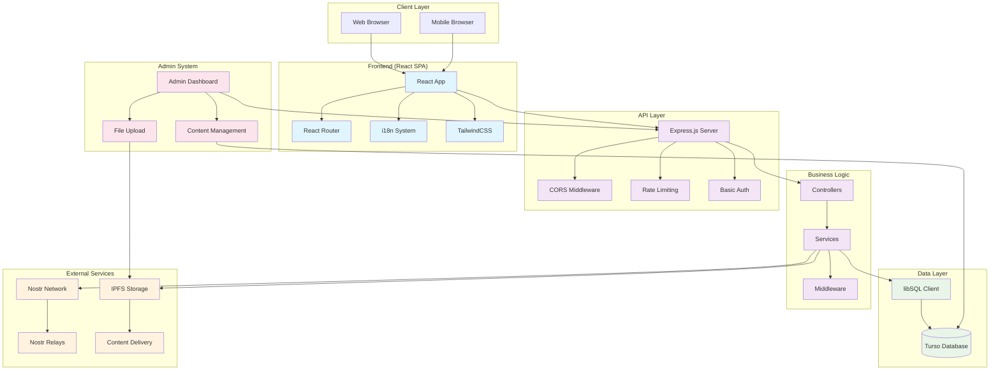
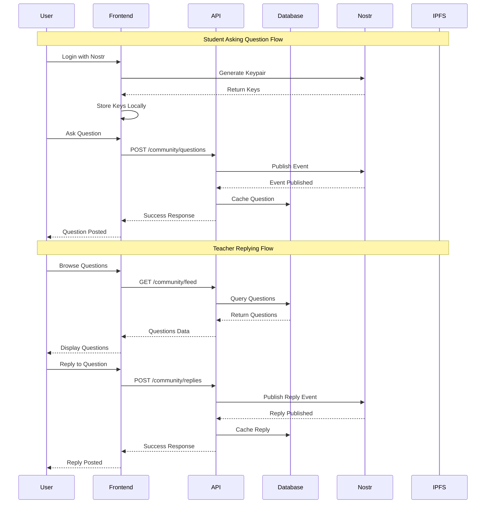
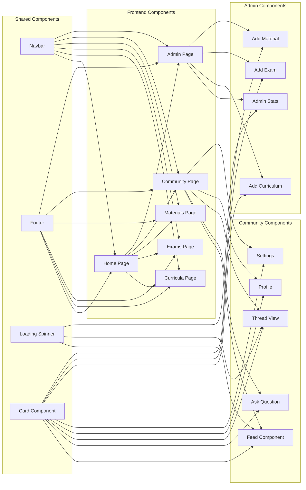
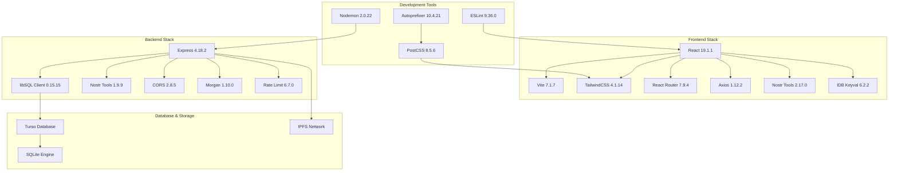

# Blue Orb Architecture Diagram

```mermaid
graph TB
    subgraph "Client Layer"
        WEB[Web Browser]
        MOBILE[Mobile Browser]
    end
    
    subgraph "Frontend (React SPA)"
        REACT[React App]
        ROUTER[React Router]
        I18N[i18n System]
        TAILWIND[TailwindCSS]
    end
    
    subgraph "API Layer"
        EXPRESS[Express.js Server]
        CORS[CORS Middleware]
        RATE[Rate Limiting]
        AUTH[Basic Auth]
    end
    
    subgraph "Business Logic"
        CONTROLLERS[Controllers]
        SERVICES[Services]
        MIDDLEWARE[Middleware]
    end
    
    subgraph "Data Layer"
        TURSO[(Turso Database)]
        LIBSQL[libSQL Client]
    end
    
    subgraph "External Services"
        NOSTR[Nostr Network]
        RELAY[Nostr Relays]
        IPFS[IPFS Storage]
        CDN[Content Delivery]
    end
    
    subgraph "Admin System"
        ADMIN[Admin Dashboard]
        UPLOAD[File Upload]
        MANAGE[Content Management]
    end
    
    %% Client connections
    WEB --> REACT
    MOBILE --> REACT
    
    %% Frontend internal
    REACT --> ROUTER
    REACT --> I18N
    REACT --> TAILWIND
    
    %% API connections
    REACT --> EXPRESS
    EXPRESS --> CORS
    EXPRESS --> RATE
    EXPRESS --> AUTH
    
    %% Business logic
    EXPRESS --> CONTROLLERS
    CONTROLLERS --> SERVICES
    SERVICES --> MIDDLEWARE
    
    %% Data connections
    SERVICES --> LIBSQL
    LIBSQL --> TURSO
    
    %% External service connections
    SERVICES --> NOSTR
    NOSTR --> RELAY
    SERVICES --> IPFS
    IPFS --> CDN
    
    %% Admin connections
    ADMIN --> EXPRESS
    ADMIN --> UPLOAD
    UPLOAD --> IPFS
    ADMIN --> MANAGE
    MANAGE --> TURSO
    
    %% Styling
    classDef frontend fill:#e1f5fe
    classDef backend fill:#f3e5f5
    classDef database fill:#e8f5e8
    classDef external fill:#fff3e0
    classDef admin fill:#fce4ec
    
    class REACT,ROUTER,I18N,TAILWIND frontend
    class EXPRESS,CORS,RATE,AUTH,CONTROLLERS,SERVICES,MIDDLEWARE backend
    class TURSO,LIBSQL database
    class NOSTR,RELAY,IPFS,CDN external
    class ADMIN,UPLOAD,MANAGE admin
```

## Data Flow Architecture

```mermaid
sequenceDiagram
    participant U as User
    participant F as Frontend
    participant A as API
    participant D as Database
    participant N as Nostr
    participant I as IPFS
    
    Note over U,I: Student Asking Question Flow
    
    U->>F: Login with Nostr
    F->>N: Generate Keypair
    N-->>F: Return Keys
    F->>F: Store Keys Locally
    
    U->>F: Ask Question
    F->>A: POST /community/questions
    A->>N: Publish Event
    N-->>A: Event Published
    A->>D: Cache Question
    A-->>F: Success Response
    F-->>U: Question Posted
    
    Note over U,I: Teacher Replying Flow
    
    U->>F: Browse Questions
    F->>A: GET /community/feed
    A->>D: Query Questions
    D-->>A: Return Questions
    A-->>F: Questions Data
    F-->>U: Display Questions
    
    U->>F: Reply to Question
    F->>A: POST /community/replies
    A->>N: Publish Reply Event
    N-->>A: Reply Published
    A->>D: Cache Reply
    A-->>F: Success Response
    F-->>U: Reply Posted
```

## Component Interaction Diagram

```mermaid
graph LR
    subgraph "Frontend Components"
        HOME[Home Page]
        CURR[Curricula Page]
        EXAMS[Exams Page]
        MAT[Materials Page]
        COMM[Community Page]
        ADMIN[Admin Page]
    end
    
    subgraph "Community Components"
        FEED[Feed Component]
        ASK[Ask Question]
        THREAD[Thread View]
        PROFILE[Profile]
        SETTINGS[Settings]
    end
    
    subgraph "Admin Components"
        STATS[Admin Stats]
        ADDCURR[Add Curriculum]
        ADDEXAM[Add Exam]
        ADDMAT[Add Material]
    end
    
    subgraph "Shared Components"
        NAV[Navbar]
        FOOT[Footer]
        LOAD[Loading Spinner]
        CARD[Card Component]
    end
    
    %% Page connections
    HOME --> CURR
    HOME --> EXAMS
    HOME --> MAT
    HOME --> COMM
    HOME --> ADMIN
    
    %% Community internal
    COMM --> FEED
    COMM --> ASK
    COMM --> THREAD
    COMM --> PROFILE
    COMM --> SETTINGS
    
    %% Admin internal
    ADMIN --> STATS
    ADMIN --> ADDCURR
    ADMIN --> ADDEXAM
    ADMIN --> ADDMAT
    
    %% Shared components
    NAV --> HOME
    NAV --> CURR
    NAV --> EXAMS
    NAV --> MAT
    NAV --> COMM
    NAV --> ADMIN
    
    FOOT --> HOME
    FOOT --> CURR
    FOOT --> EXAMS
    FOOT --> MAT
    FOOT --> COMM
    FOOT --> ADMIN
    
    %% Component usage
    CARD --> FEED
    CARD --> ASK
    CARD --> THREAD
    CARD --> PROFILE
    CARD --> SETTINGS
    CARD --> ADDCURR
    CARD --> ADDEXAM
    CARD --> ADDMAT
    
    LOAD --> FEED
    LOAD --> THREAD
    LOAD --> STATS
```

## Technology Stack Diagram

```mermaid
graph TB
    subgraph "Frontend Stack"
        REACT[React 19.1.1]
        VITE[Vite 7.1.7]
        TAILWIND[TailwindCSS 4.1.14]
        ROUTER[React Router 7.9.4]
        AXIOS[Axios 1.12.2]
        NOSTR_TOOLS[Nostr Tools 2.17.0]
        IDB[IDB Keyval 6.2.2]
    end
    
    subgraph "Backend Stack"
        EXPRESS[Express 4.18.2]
        LIBSQL[libSQL Client 0.15.15]
        NOSTR_SERVER[Nostr Tools 1.9.9]
        CORS[CORS 2.8.5]
        MORGAN[Morgan 1.10.0]
        RATE_LIMIT[Rate Limit 6.7.0]
    end
    
    subgraph "Database & Storage"
        TURSO[Turso Database]
        SQLITE[SQLite Engine]
        IPFS[IPFS Network]
    end
    
    subgraph "Development Tools"
        NODEMON[Nodemon 2.0.22]
        ESLINT[ESLint 9.36.0]
        POSTCSS[PostCSS 8.5.6]
        AUTOPREFIXER[Autoprefixer 10.4.21]
    end
    
    %% Frontend connections
    REACT --> VITE
    REACT --> TAILWIND
    REACT --> ROUTER
    REACT --> AXIOS
    REACT --> NOSTR_TOOLS
    REACT --> IDB
    
    %% Backend connections
    EXPRESS --> LIBSQL
    EXPRESS --> NOSTR_SERVER
    EXPRESS --> CORS
    EXPRESS --> MORGAN
    EXPRESS --> RATE_LIMIT
    
    %% Data connections
    LIBSQL --> TURSO
    TURSO --> SQLITE
    EXPRESS --> IPFS
    
    %% Development
    NODEMON --> EXPRESS
    ESLINT --> REACT
    POSTCSS --> TAILWIND
    AUTOPREFIXER --> POSTCSS
```
